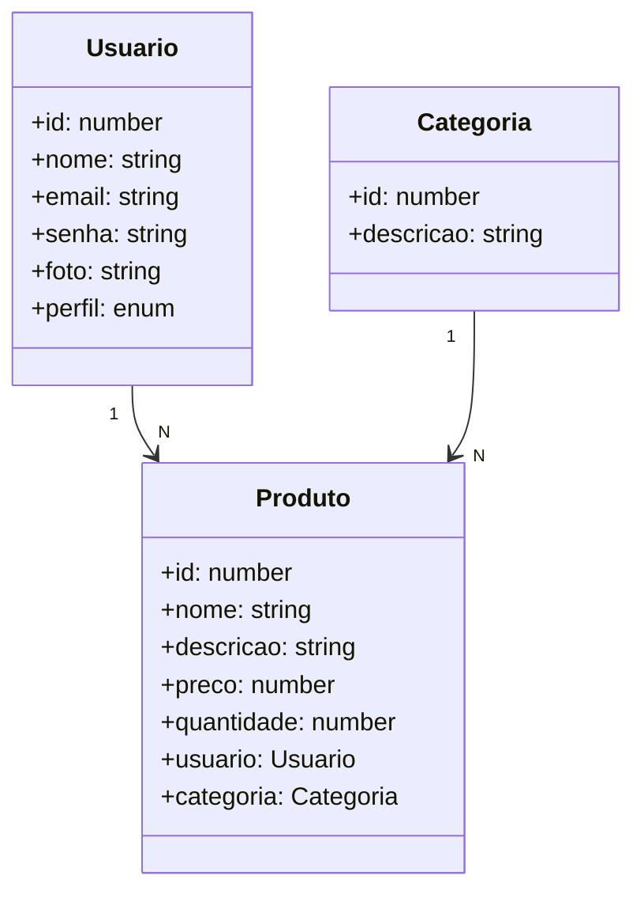

# 📊 FLOW CRM - Sistema de Gerenciamento Comercial

Projeto desenvolvido pelo **Grupo 2** para o desafio prático da Generation Brasil, com o objetivo de criar um sistema CRM para gestão de usuários, categorias e produtos.

---

## 🧾 1. Sobre o Projeto

O sistema FLOW CRM foi criado para auxiliar empresas no gerenciamento de **produtos**, **categorias** e **usuários** em diferentes níveis de acesso. Ele permite realizar operações de **cadastro, listagem, atualização e exclusão (CRUD)** de forma simples e funcional.

O projeto segue boas práticas de desenvolvimento com NestJS e integração com banco de dados relacional via TypeORM.

---

## 🧱 2. Estrutura das Entidades

- **Usuário:** id, nome, email, senha, foto, perfil (enum)
- **Categoria:** id, descrição
- **Produto:** id, nome, descrição, preço, quantidade, categoria_id (FK), usuario_id (FK)

---

## 🔗 3. Diagrama Entidade-Relacionamento:



> Ou seja, cada produto pertence a um único usuário e uma única categoria.  
> Cada usuário e cada categoria pode estar associado a vários produtos.

---

## 🧰 4. Tecnologias Utilizadas

- **NestJS (TypeScript)** – Back-end
- **TypeORM** – ORM
- **MySQL** – Banco de dados relacional
- **Insomnia** – Testes de API REST
- **Git + GitHub** – Versionamento
- **Node.js + VSCode**

---

## 🔁 5. Funcionalidades

### Usuário
- Criar, listar, buscar por ID ou nome, atualizar e deletar.

### Categoria
- Criar, listar, buscar por ID ou descrição, atualizar e deletar.

### Produto
- Criar, listar, buscar por ID ou nome, buscar por faixa de preço, atualizar e deletar.

---

## 📦 6. Estrutura RESTful

O projeto está organizado em:
- **Controller**
- **Service**
- **Entity**
- **Module**
- **Enum**

Com base nas boas práticas do NestJS, garantindo separação de responsabilidades e facilidade de manutenção.

---

## 🧪 7. Testes com Insomnia

Todos os endpoints foram testados utilizando o **Insomnia**, garantindo o funcionamento correto de cada operação nas três entidades principais.

---

## 🚀 8. Como Executar o Projeto

### Pré-requisitos
- Node.js instalado
- MySQL rodando
- Arquivo `app.module` configurado corretamente com as credenciais do banco

### Passos

```bash
# Instale as dependências
npm install

# Rode o projeto em modo desenvolvimento
npm run start:dev
```

---

## 📄 9. Considerações Finais

O projeto foi desenvolvido como parte do desafio prático da Generation Brasil, aplicando conhecimentos de APIs REST, banco de dados, versionamento com Git e desenvolvimento em equipe.

---

## 👤 10. Sobre

Projeto desenvolvido por  

## 👥 Equipe

- [Adrielli Bertoldo](https://github.com/Adrielli-Bertoldo)
- [Diego Cavalcanti](https://github.com/diegocavalcanti-dev)
- [Natália Gadelha](https://github.com/NataliaGadelha)
- [Natália Taira](https://github.com/nataliataira)
- [Nathalia Carvalho](https://github.com/naahcarvalho)
- [Miguel Ferreira](https://github.com/devvMiguel)
- [Taís Escobar](https://github.com/taismichely)

---
Projeto acadêmico | Generation Brasil - 2025
